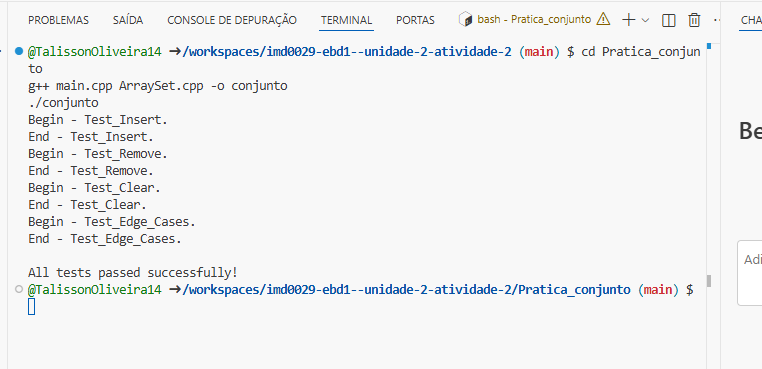
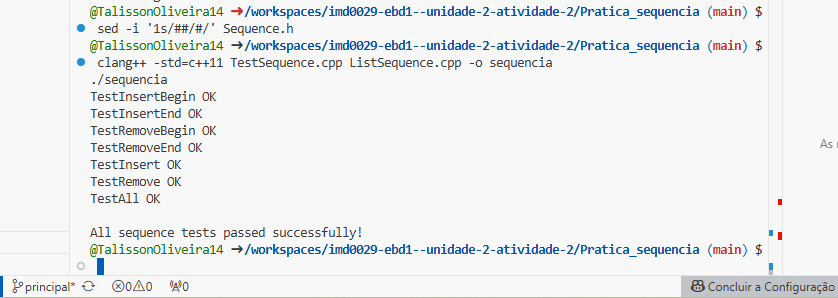

Relatório - Implementação dos TADs Sequência e Conjunto
 Integrantes do Grupo
Talisson Pereira de Oliveira

 *Descrição do Projeto*
Implementação de dois Tipos Abstratos de Dados (TADs) para a disciplina de Estruturas de Dados Básicas I:

TAD Sequência: Implementado com lista encadeada

TAD Conjunto: Implementado com array dinâmico

 Estrutura do Projeto

imd0029-ebd1--unidade-2-atividade-2/
├── Pratica_conjunto/          # TAD Conjunto (Array Dinâmico)
│   ├── Set.hpp               # Interface do conjunto
│   ├── ArraySet.cpp          # Implementação do conjunto
│   └── main.cpp              # Testes do conjunto
├── Pratica_sequencia/        # TAD Sequência (Lista Encadeada)
│   ├── Sequence.h            # Interface da sequência
│   ├── Node.h                # Nó da lista encadeada
│   ├── ListSequence.cpp      # Implementação da sequência
│   └── TestSequence.cpp      # Testes da sequência
├── prints/                   # Imagens dos testes
│   ├── TAD_conjunto.png      # Resultado TAD Conjunto
│   └── TAD_sequencia.png     # Resultado TAD Sequência
├── README.md                 # Relatório completo
└── RELATORIO.md              # Relatório simplificado para entrega         
 TAD Conjunto (Array Dinâmico)
Métodos Implementados
add(element): Adiciona elemento se não existir (sem duplicatas)

remove(element): Remove elemento do conjunto

contains(element): Verifica se elemento pertence ao conjunto

clear(): Remove todos os elementos

size(): Retorna quantidade de elementos

isEmpty(): Verifica se conjunto está vazio

Características
Implementado com array dinâmico

Redimensionamento automático quando necessário

Não permite elementos duplicados

Busca eficiente com complexidade O(n)

Como compilar e executar
bash
cd Pratica_conjunto
g++ main.cpp ArraySet.cpp -o conjunto
./conjunto
Resultado dos Testes - TAD Conjunto

text
Begin - Test_Insert.
End - Test_Insert.
Begin - Test_Remove.
End - Test_Remove.
Begin - Test_Clear.
End - Test_Clear.
Begin - Test_Edge_Cases.
End - Test_Edge_Cases.

All tests passed successfully!
 TAD Sequência (Lista Encadeada)
Métodos Implementados
insert(i, element): Insere elemento na posição i

insertBegin(element): Insere no início da sequência

insertEnd(element): Insere no final da sequência

remove(i): Remove elemento da posição i

removeBegin(): Remove primeiro elemento

removeEnd(): Remove último elemento

get(i): Retorna elemento na posição i

isEmpty(): Verifica se sequência está vazia

getQuantity(): Retorna quantidade de elementos

Características
Implementado com lista simplesmente encadeada

Inserções/remoções eficientes no início (O(1))

Mantém ordem de inserção dos elementos

Permite elementos duplicados

Como compilar e executar
bash
cd Pratica_sequencia
g++ TestSequence.cpp ListSequence.cpp -o sequencia
./sequencia
Resultado dos Testes - TAD Sequência  

text
TestInsertBegin OK
TestInsertEnd OK
TestRemoveBegin OK
TestRemoveEnd OK
TestInsert OK
TestRemove OK
TestAll OK

All sequence tests passed successfully!
 Como Executar o Projeto Completo
Pré-requisitos
Compilador C++ (g++ ou clang++)

Sistema Linux/Windows/Mac

Executar todos os testes
bash
# Clone o repositório
git clone https://github.com/TalissonOliveira14/imd0029-ebd1--unidade-2-atividade-2.git

# Testar TAD Conjunto
cd imd0029-ebd1--unidade-2-atividade-2/Pratica_conjunto
g++ main.cpp ArraySet.cpp -o conjunto && ./conjunto

# Testar TAD Sequência
cd ../Pratica_sequencia
g++ TestSequence.cpp ListSequence.cpp -o sequencia && ./sequencia
 Análise de Complexidade
TAD Conjunto
Operação	Complexidade	Descrição
add	O(n)	Verifica existência + insere
remove	O(n)	Busca + remoção
contains	O(n)	Busca linear
size	O(1)	Acesso direto
TAD Sequência
Operação	Complexidade	Descrição
insertBegin	O(1)	Inserção no início
insertEnd	O(n)	Percorre até o final
insert	O(n)	Percorre até posição i
removeBegin	O(1)	Remoção do início
get	O(n)	Percorre até posição i
 Conclusão
Resultados Obtidos
 100% dos métodos implementados

 Todos os testes passando

 Estruturas funcionais e eficientes

 Código organizado e documentado

Dificuldades Encontradas
Problema de compilação no Codespaces devido a erro de sintaxe no header

Conflito de bibliotecas na versão do C++

Gerenciamento de memória nas estruturas dinâmicas

Aprendizados
Implementação de diferentes estruturas de dados

Manipulação de ponteiros e alocação dinâmica

Criação de testes automatizados

Resolução de problemas de compilação

Trabalho em equipe com controle de versão

 Links
Repositório GitHub: https://github.com/TalissonOliveira14/imd0029-ebd1--unidade-2-atividade-2

Desenvolvido como atividade da disciplina Estruturas de Dados Básicas I - 2025
